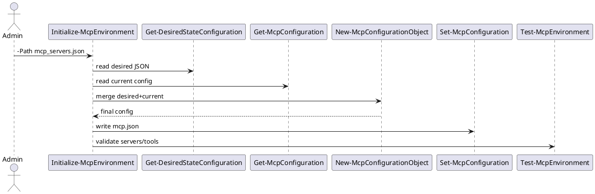
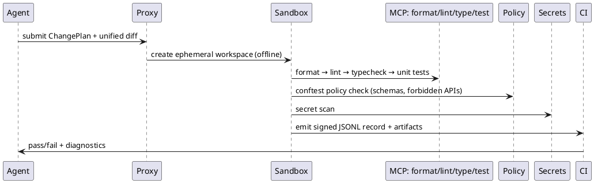

# SPEC-1—AI Upkeep Suite v2 (Guardrails + MCP)

## Background

Your current **AI Upkeep Suite** already gives you a strong, headless foundation for secrets, upgrades, permissions, MCP configs, testing, self‑healing, and observability across Windows/PowerShell + Python environments. In this v2, we add a **Code Quality Enforcement Layer (CQEL)** that *forces* higher‑quality AI code output across any app that writes/edits code by:

- **Central MCP Tool Plane**: Standardize all code-quality tools (formatters, linters, test runners, SAST, license/secret scanners) behind MCP servers. LLMs and agents discover and invoke only **approved** tools via the same interface.
- **Guardrail Chain (input → output → runtime)**: Pre‑prompt constraints (no insecure patterns), structured output contracts (diff schema + rationale), and runtime guardrails (block/flag PII, secrets, unsafe ops) that can *halt tool execution* or *reject patches*.
- **SafePatch Validation**: Every AI diff must pass policy: formatting, linting, unit tests in an ephemeral sandbox, Semgrep/custom rules, dependency/licensing checks, and forbidden‑path guards before it can be committed/PR’d.
- **Access‑Scoped Execution**: Per‑key/team access groups control which MCP tools a caller may see/use. This constrains models/agents from bypassing policy.
- **Tight Feedback Loop**: Tool results flow back to the model; the agent iterates until the patch is green or times out—keeping a cryptographically signed ledger of attempts and outcomes.
- **Fits the Suite’s DNA**: Uses your existing ledgers, SLO/error budgets, upgrade/canary, and STOP files. Adds nightly drift‑detection for repo guardrails and a weekly enforcement report (coverage, lint pass rate, rule violations).

## Requirements

### MoSCoW

**Must**
- **MCP‑constrained tool plane**: All code‑quality operations (formatter, linter, type‑check, tests, SAST, license/secret scans) are discoverable and callable **only** via approved MCP servers and **access groups**; non‑allow‑listed tools are invisible to models/agents.
- **Spec‑first generation**: Every task provides a tiny, non‑negotiable spec (OS/shell versions, *no external network calls*, idempotency, inputs/outputs, success tests). PS style guards (StrictMode, `$ErrorActionPreference='Stop'`, `[CmdletBinding(SupportsShouldProcess=$true)]`); Python style guards (type hints, `argparse`, logging, no prints except final result). Code‑only deliverables.
- **Self‑defensive skeletons**: Canonical PS starter (`#Requires -Version 5.1`, StrictMode, validated params, `trap` → non‑zero exit, `ShouldProcess` gate). Canonical Python starter (typed CLI via `argparse`, structured logging, `main()` with status codes, single fatal log on exception).
- **Minimal diffs**: Agents must propose **unified diffs** (patches) against existing files; whole‑file rewrites are rejected unless explicitly permitted.
- **Local validators (pre‑commit)**: Python (black, ruff, mypy, pytest); PowerShell (PSScriptAnalyzer, Pester); TS/JS (ESLint/Prettier/`tsc`); repo‑wide Semgrep; secret scanners. Hooks mirror CI.
- **Environmental constraints & forbidden APIs**: Pinned runtimes; realistic Windows paths (with spaces). Forbid `Write-Host` for core output and general `print` except final result; block risky APIs (`Invoke-Expression`, raw `eval`, uncontrolled shelling out) via analyzer rules + Semgrep.
- **Golden data**: Ship tiny, real fixtures used by local/CI validation to remove ambiguity.
- **CI backstop & PR gating**: Windows‑first CI that runs `Verify.ps1` (PSSA + Pester) and Python/TS pipelines; **fail on warnings** for analyzers; branch protection + CODEOWNERS enforce green checks before merge.
- **Structured outputs**: Guardrails/grammar constraints require valid JSON for change‑plan + diff schema + test stubs; invalid shapes are rejected pre‑execution.
- **SafePatch validation pipeline**: For each AI diff: format → lint/type‑check → unit tests in **ephemeral sandbox** → SAST (Semgrep) → policy (Conftest/OPA) → license/secret scan → SBOM (where applicable). Any red blocks commit/PR.
- **Policy‑as‑code**: Validate generated YAML/JSON/TOML against organization schemas; required fields, allowed modules/cmdlets, and safe parameters.
- **Run ledgers & auditability**: Append‑only JSONL for every attempt (inputs, tool calls, diffs, results), cryptographically signed; weekly report on pass rates, violations, drift.
- **Drift detection**: Nightly verification of repo guardrails (branch protection, required checks, CODEOWNERS) with auto‑remediation PRs.
- **Dependency hygiene**: Renovate for pinning/upgrades with PR review rules.

**Should**
- Property‑based tests for critical functions; mutation testing for key modules over time.
- Build graph/caching for larger repos (Nx/Bazel) to reduce CI cost.
- Red‑team checklists baked into prompts (WinPS vs PS7 pitfalls, null/path safety, error surfaces) and echoed in tests.
- ChatOps entrypoints to run Verify locally/remote and to request minimal patch templates.

**Could**
- Additional languages (Go/Rust/Terraform) with equivalent guardrails.
- PR bot auto‑fix for trivial issues (formatting, import order) before human review.
- Flaky test quarantine with auto‑filed issues and retry budget.

**Won’t (for v2)**
- Replace existing CI/CD; this layer **gates** quality but does not deploy.
- Manage application business logic beyond health/quality constraints.
- Permit networked generation or tool installation from unpinned sources.

### Quality bars & acceptance criteria
- **Analyzers**: PSScriptAnalyzer/ESLint/Ruff have **0 warnings tolerated** on protected branches.
- **Typing**: Python mypy strict on changed files; TS `strict` true; PS parameter types explicit.
- **Tests**: Pester/pytest required on changed code; minimum line coverage target ≥ 70% for touched modules (project‑level target can grow over time).
- **SAST/Secrets**: Semgrep + secret scanner must pass; any HIGH finding blocks.
- **Artifacts**: For PS deliverables, the agent must emit a release bundle (`/src`, `/tests`, `PSScriptAnalyzerSettings.psd1`, `Verify.ps1`). For Python/TS, equivalent `pyproject.toml`/`package.json` + test scaffolds.
- **Human review**: CODEOWNERS review required for critical paths; bots cannot approve their own PRs.

## Method

### 1) Architecture overview

```plantuml
@startuml
actor Developer as Dev
actor "AI Agent / LLM" as LLM
rectangle "LiteLLM Proxy
(+ Guardrail Middleware)" as Proxy
node "MCP Tool Plane" as MCP {
  [formatter‑python (black/ruff)] as T1
  [typecheck‑python (mypy)] as T2
  [test‑python (pytest)] as T3
  [lint‑powershell (PSScriptAnalyzer)] as T4
  [test‑powershell (Pester)] as T5
  [sast (Semgrep)] as T6
  [secrets (scanner)] as T7
  [policy (Conftest/OPA)] as T8
}
cloud "Git Provider" as Git
queue "CI (GitHub Actions)" as CI
folder "Repos" as Repos
storage "Run Ledger (JSONL + signatures)" as Ledger

Dev --> LLM : task/spec
LLM <-> Proxy : /v1/mcp/* (tools, call, run)
Proxy --> MCP : call approved tool
LLM --> Repos : propose unified diff
Proxy --> CI : trigger Verify pipeline (no network)
CI --> MCP : tools executed in sandbox
CI --> Git : PR status checks
CI --> Ledger : append results
LLM <-- Ledger : feedback for auto‑fix
@enduml
```

**Key controls**
- **MCP‑only tools**: All quality actions are invoked through MCP servers behind the proxy; access‑groups decide visibility and execution rights.
- **Grammar/Schema guardrails**: Models must emit **ChangePlan JSON** and **UnifiedDiff** only; invalid shapes are rejected before any file touch.
- **SafePatch pipeline**: Every diff enters a deterministic validation chain (format→lint→type→test→SAST→policy→secrets→SBOM[opt]).
- **Ephemeral sandbox**: Per‑run workspace; **no outbound network**; Windows runner for PowerShell, Linux runner for Python/TS.

---

### 2) MCP servers (catalog & policies)

**Server classes**
- `code.format.*` → black/ruff, Prettier
- `code.lint.*` → Ruff, ESLint, PSScriptAnalyzer
- `code.typecheck.*` → mypy, `tsc`
- `code.test.*` → pytest, Pester
- `code.sast.*` → Semgrep rulesets (org + custom)
- `code.secrets.*` → secret scanner
- `code.policy.*` → Conftest/OPA bundles

**Access groups**
- `reader` (list tools only)
- `contributor` (format, lint, typecheck, tests)
- `maintainer` (+ SAST, policy, secrets, release)

**Discovery & health**: `GET /v1/mcp/tools` exposes only the group’s tools; `GET /v1/mcp/servers/health` drives auto‑quarantine of unhealthy servers.

**Data‑driven configuration** (PowerShell module)
- File: `mcp_servers.json` (authoritative desired state) → `Get‑DesiredStateConfiguration` → `New‑McpConfigurationObject` (merge with current) → `Set‑McpConfiguration`.
- Orchestrator: `Initialize‑McpEnvironment -Path <json>` performs install → read desired/current → merge → write → validate.

Example `mcp_servers.json` (extensible):
```json
{
  "servers": {
    "python-quality": {"type": "process", "cmd": "python", "args": ["-m","quality_mcp"]},
    "powershell-quality": {"type": "process", "cmd": "pwsh", "args": ["-File","./ps_quality_mcp.ps1"]},
    "semgrep": {"type": "process", "cmd": "semgrep", "args": ["mcp"]},
    "policy": {"type": "process", "cmd": "conftest", "args": ["mcp"]}
  },
  "tools": {"run_command_in_terminal": false}
}
```

Sequence (configurator):


---

### 3) Guardrail contracts (schemas)

**3.1 ChangePlan (model output)**
```json
{
  "$schema": "https://json-schema.org/draft/2020-12/schema",
  "title": "ChangePlan",
  "type": "object",
  "required": ["repo","rationale","changes","tests","risk","gates"],
  "properties": {
    "repo": {"type": "string"},
    "rationale": {"type": "string", "maxLength": 800},
    "risk": {"type": "string", "enum": ["low","medium","high"]},
    "gates": {"type": "array", "items": {"enum": ["format","lint","type","test","sast","policy","secrets"]}},
    "changes": {"type": "array", "minItems": 1, "items": {
      "type": "object",
      "required": ["path","diff"],
      "properties": {
        "path": {"type": "string"},
        "diff": {"type": "string", "description": "unified diff (no full rewrites)"}
      }
    }},
    "tests": {"type": "array", "minItems": 1, "items": {"type": "string"}}
  }
}
```

**3.2 UnifiedDiff guard**
- Must be a standard **unified diff**; patch applies cleanly.
- File additions permitted only in `src/` or `tests/` unless policy allows.
- Binary files, secrets, and lockfiles blocked.

**3.3 Delivery bundles**
- **PowerShell**: `/src`, `/tests`, `PSScriptAnalyzerSettings.psd1`, `Verify.ps1`.
- **Python**: `/src`, `/tests`, `pyproject.toml`, `ruff.toml` (or `ruff` in `pyproject`), `mypy.ini`.
- **TS/Node**: `/src`, `/tests`, `package.json`, `tsconfig.json`, `.eslintrc.*`.

---

### 4) SafePatch validation pipeline (deterministic)



**Blocking rules**
- Any analyzer **warning** on protected branches.
- Missing/invalid tests.
- Policy violations (OPA), Semgrep HIGH, or secrets found.
- Diff touching forbidden paths.

---

### 5) Self‑defensive code skeletons (canonical)

**PowerShell**
- `#Requires -Version 5.1`, `Set-StrictMode -Version Latest`, `$ErrorActionPreference='Stop'`, `[CmdletBinding(SupportsShouldProcess=$true)]`, validated parameters, global `trap { exit 1 }`.
- Pester tests for each public function; Verify.ps1 runs PSSA + Pester.

**Python**
- Typed CLI via `argparse`, `logging` (no prints except final result), `main()` returns exit codes; pytest + type‑checked (mypy).

Both include **run headers**, **step markers with timeouts**, and **JSONL event logging**; agents must prefer **minimal diffs**.

---

### 6) Policy & data model (minimal, implementable)

**Relational core** (can be SQLite/Postgres)
```sql
CREATE TABLE access_groups (
  id INTEGER PRIMARY KEY, name TEXT UNIQUE NOT NULL
);
CREATE TABLE tools (
  id INTEGER PRIMARY KEY, name TEXT UNIQUE NOT NULL, server TEXT NOT NULL
);
CREATE TABLE group_tools (
  group_id INTEGER NOT NULL, tool_id INTEGER NOT NULL,
  PRIMARY KEY (group_id, tool_id)
);
CREATE TABLE policies (
  id INTEGER PRIMARY KEY, name TEXT UNIQUE NOT NULL, mode TEXT CHECK(mode IN ('audit','enforce')) NOT NULL
);
CREATE TABLE policy_rules (
  id INTEGER PRIMARY KEY, policy_id INTEGER NOT NULL, rule TEXT NOT NULL, severity TEXT NOT NULL
);
CREATE TABLE run_ledger (
  id INTEGER PRIMARY KEY, run_id TEXT UNIQUE NOT NULL, timestamp TEXT NOT NULL,
  actor TEXT, repo TEXT, result TEXT, artifact_path TEXT, sig TEXT
);
```

**OPA/Conftest examples**
- Reject `Write-Host` for core output, require `[CmdletBinding()]`, enforce `no network` flag.
- For Python, forbid `subprocess.Popen(..., shell=True)` and bare `print()` outside final output.

---

### 7) Prompt & output patterns

**Spec‑first prompt header** (PowerShell example)
```
You will produce: (1) ChangePlan JSON, (2) unified diff. OS: Windows Server 2022. Shell: PowerShell 5.1 & 7.4. No external network calls. Idempotent.
Style: StrictMode, $ErrorActionPreference='Stop', [CmdletBinding(SupportsShouldProcess=$true)], no aliases, no Write-Host.
Tests to pass: Pester template in /tests. Deliver code-only in two fenced blocks.
```

**Failure loop**
- Tool outputs are fed back to the agent; it may submit **one** auto‑fix patch per failure class (format/lint/test/policy/secrets) before human review.

---

### 8) Windows‑first CI topology
- `windows-latest` runner executes `Verify.ps1` (PSSA + Pester), mirrors pre‑commit.
- Parallel jobs: Python/TS pipelines on Linux with cache.
- Branch protections: required checks, linear history, CODEOWNERS.

---

### 9) Security & isolation
- Sandbox users without network; allow only MCP tool binaries.
- Sign ledger entries; store artifacts for 30–90 days.
- Nightly drift‑detection of protections + auto‑PR remediation.

## Implementation

### 0) Repository scaffolding (once per repo)
```
repo/
  .editorconfig
  .pre-commit-config.yaml
  .semgrep/semgrep.yml
  policy/changeplan.rego
  tools/Verify.ps1
  tools/PSScriptAnalyzerSettings.psd1
  scripts/sandbox_linux.sh
  scripts/sandbox_windows.ps1
  .mcp/mcp_servers.json
  .github/workflows/quality.yml
```

**0.1 .editorconfig (excerpt)**
```
root = true
[*]
end_of_line = lf
insert_final_newline = true
charset = utf-8
indent_style = space
indent_size = 2
```

**0.2 Project conventions (add as README or docs/conventions.md)**
- PowerShell: StrictMode, no aliases, `Write-Host` forbidden for outputs, `[CmdletBinding()]`, validated parameters.
- Python: typed, `argparse` CLI, `logging` only; no `print()` except final result.
- TS: `tsconfig.json` with `"strict": true`; ESLint required.

---

### 1) Guardrail contracts & policy

**1.1 ChangePlan JSON Schema** → keep as in *Method* (Section 3.1). Store under `policy/changeplan.schema.json`.

**1.2 OPA/Conftest policy (policy/changeplan.rego)**
```
package changeplan

deny[msg] {
  input.repo == ""
  msg := "repo is required"
}

deny[msg] {
  count(input.changes) == 0
  msg := "at least one change is required"
}

deny[msg] {
  some i
  input.changes[i].path != "";
  startswith(input.changes[i].path, "/")
  msg := sprintf("absolute paths forbidden: %v", [input.changes[i].path])
}

deny[msg] {
  some g
  not input.gates[g]
  msg := "gates array must be present"
}
```

**1.3 Semgrep rules (.semgrep/semgrep.yml)**
```
rules:
  - id: ps-avoid-write-host
    languages: [powershell]
    message: "Use Write-Output or structured logging; Write-Host is forbidden for core output"
    severity: ERROR
    pattern: Write-Host

  - id: py-no-shell-true
    languages: [python]
    message: "Avoid shell=True in subprocess calls"
    severity: ERROR
    patterns:
      - pattern: subprocess.$FUNC(..., shell=True, ...)

  - id: py-no-print-except-final
    languages: [python]
    message: "Use logging; print() only for final result"
    severity: WARNING
    pattern: print(...)

  - id: js-ts-no-eval
    languages: [javascript, typescript]
    message: "Avoid eval for security"
    severity: ERROR
    pattern: eval(...)
```

---

### 2) Self‑defensive skeletons & local verifier

**2.1 tools/PSScriptAnalyzerSettings.psd1 (minimal, extend as needed)**
```
@{
    ExcludeRules = @()
    IncludeRules = @(
        'PSAvoidUsingWriteHost',
        'PSAvoidUsingCmdletAliases',
        'PSUseApprovedVerbs',
        'PSUseConsistentWhitespace',
        'PSUseDeclaredVarsMoreThanAssignments',
        'PSUseBOMForUnicodeEncodedFile'
    )
}
```

**2.2 tools/Verify.ps1**
```
[CmdletBinding()]
param(
  [switch]$CI,
  [switch]$NoInstall
)

Set-StrictMode -Version Latest
$ErrorActionPreference = 'Stop'
$here = Split-Path -Parent $PSCommandPath

if(-not $CI -and -not $NoInstall){
  if(-not (Get-Module -ListAvailable -Name PSScriptAnalyzer)){ Install-Module PSScriptAnalyzer -Scope CurrentUser -Force }
  if(-not (Get-Module -ListAvailable -Name Pester)){ Install-Module Pester -Scope CurrentUser -Force }
}

Write-Host "== PSScriptAnalyzer =="
Invoke-ScriptAnalyzer -Settings "$here/PSScriptAnalyzerSettings.psd1" -Path ./ -Recurse -Severity @('Error','Warning') | Tee-Object -Variable pssa
if($pssa){ throw "PSScriptAnalyzer findings present" }

Write-Host "== Pester =="
Invoke-Pester -CI -Output Detailed -PassThru | Tee-Object -Variable pester | Out-Null
if($pester.FailedCount -gt 0){ throw "Pester tests failed" }

Write-Host "== OK ==" -ForegroundColor Green
```

**2.3 scripts/sandbox_linux.sh** (offline sandbox for Python/TS)
```
#!/usr/bin/env bash
set -euo pipefail
# Run the given command in a new network namespace (no network)
sudo unshare -n bash -lc "$*"
```

**2.4 scripts/sandbox_windows.ps1** (best‑effort offline for a step)
```
[CmdletBinding()]param([Parameter(Mandatory)][string]$Command)
$rules = @(
  @{Name='Block-pwsh7'; Program=(Join-Path $env:ProgramFiles 'PowerShell/7/pwsh.exe')},
  @{Name='Block-powershell51'; Program=(Join-Path $env:WINDIR 'System32/WindowsPowerShell/v1.0/powershell.exe')}
)
foreach($r in $rules){ New-NetFirewallRule -DisplayName $r.Name -Direction Outbound -Action Block -Program $r.Program -ErrorAction SilentlyContinue | Out-Null }
try { & pwsh -NoLogo -NoProfile -NonInteractive -Command $Command }
finally { foreach($r in $rules){ Get-NetFirewallRule -DisplayName $r.Name -ErrorAction SilentlyContinue | Remove-NetFirewallRule -ErrorAction SilentlyContinue } }
```

---

### 3) Pre‑commit

**.pre-commit-config.yaml**
```
repos:
  - repo: https://github.com/astral-sh/ruff-pre-commit
    rev: v0.4.10
    hooks: [{ id: ruff }, { id: ruff-format }]
  - repo: https://github.com/psf/black
    rev: 24.10.0
    hooks: [{ id: black }]
  - repo: https://github.com/pre-commit/mirrors-mypy
    rev: v1.8.0
    hooks: [{ id: mypy }]
  - repo: local
    hooks:
      - id: powershell-verify
        name: PowerShell Verify (PSSA + Pester)
        entry: pwsh -NoLogo -NoProfile -File tools/Verify.ps1
        language: system
        pass_filenames: false
      - id: semgrep
        name: Semgrep SAST
        entry: semgrep -q --config .semgrep/semgrep.yml
        language: system
        pass_filenames: false
```

---

### 4) MCP data-driven configuration

**.mcp/mcp_servers.json** (starter)
```
{
  "servers": {
    "powershell-quality": {"type": "process", "cmd": "pwsh", "args": ["-File","./tools/ps_quality_mcp.ps1"]},
    "python-quality": {"type": "process", "cmd": "python", "args": ["-m","quality_mcp"]},
    "semgrep": {"type": "process", "cmd": "semgrep", "args": ["mcp"]},
    "policy": {"type": "process", "cmd": "conftest", "args": ["mcp"]},
    "secrets": {"type": "process", "cmd": "gitleaks", "args": ["mcp"]}
  },
  "tools": {"run_command_in_terminal": false}
}
```

Wire this into your configurator: `Initialize-McpEnvironment -Path .mcp/mcp_servers.json -Verbose`.

---

### 5) CI (GitHub Actions)

**.github/workflows/quality.yml**
```
name: quality
on:
  pull_request:
  push:

jobs:
  powershell:
    runs-on: windows-latest
    steps:
      - uses: actions/checkout@v4
        with: { fetch-depth: 0 }
      - name: Install PSSA & Pester
        shell: pwsh
        run: |
          Install-Module PSScriptAnalyzer -Scope CurrentUser -Force
          Install-Module Pester -Scope CurrentUser -Force
      - name: Verify (offline)
        shell: pwsh
        run: |
          ./scripts/sandbox_windows.ps1 -Command "./tools/Verify.ps1 -CI"

  python_ts:
    runs-on: ubuntu-latest
    steps:
      - uses: actions/checkout@v4
      - uses: actions/setup-python@v5
        with: { python-version: '3.12' }
      - name: Install Python toolchain
        run: |
          python -m pip install --upgrade pip
          pip install ruff black mypy pytest
      - name: Python format+lint+types+tests (offline)
        run: |
          chmod +x scripts/sandbox_linux.sh
          ./scripts/sandbox_linux.sh "ruff . && black --check . && mypy . && pytest -q"
      - name: Node toolchain
        uses: actions/setup-node@v4
        with: { node-version: '20' }
      - name: ESLint
        run: |
          npm ci --ignore-scripts
          npx eslint .

  sast_secrets_policy:
    runs-on: ubuntu-latest
    steps:
      - uses: actions/checkout@v4
        with: { fetch-depth: 0 }
      - name: Semgrep SAST
        uses: returntocorp/semgrep-action@v1
        with:
          config: .semgrep/semgrep.yml
      - name: Gitleaks
        uses: gitleaks/gitleaks-action@v2
        with: {}
        env:
          GITHUB_TOKEN: ${{ secrets.GITHUB_TOKEN }}
      - name: Conftest (ChangePlan)
        uses: instrumenta/conftest-action@v1
        with:
          files: changeplan.json
          policy: policy
```

Set **branch protections** to require all three jobs.

---

### 6) Agent prompt stubs (paste into your Custom GPT / instruction set)

**PowerShell tasks — header**
```
Produce (1) ChangePlan JSON, (2) unified diff. Shells: PS 5.1 + 7.4. No external network. Idempotent. Style: StrictMode, $ErrorActionPreference='Stop', [CmdletBinding(SupportsShouldProcess=$true)], no aliases, no Write-Host.
Deliver a release bundle: /src, /tests, PSScriptAnalyzerSettings.psd1, Verify.ps1.
```

**Python tasks — header**
```
Produce (1) ChangePlan JSON, (2) unified diff. Python 3.12. Use argparse, logging, type hints. No network calls. Tests with pytest. No print() except final result.
```

---

### 7) Operational runbook
- Roll out pre‑commit (dev machines) → enforce CI gates with branch protection.
- Use the MCP configurator to standardize tool servers; health‑check nightly.
- Monitor weekly report from run ledger (pass rate, rule violations); adjust Semgrep/OPA as needed.

## Milestones

1. **Week 1 — Bootstrap**: Add scaffolding, Verify.ps1, Semgrep/OPA, pre‑commit. Dry‑run CI.
2. **Week 2 — Audit**: CI required on PRs, warnings still allowed (observe).
3. **Week 3 — Enforce**: Fail on any analyzer warning; require tests on changed files; secrets/SAST block.
4. **Week 4 — MCP integration**: Enforce MCP‑only tools with access groups; nightly drift‑detection.
5. **Week 5 — Harden**: Offline sandboxes by default; red‑team checklist; raise coverage targets.

## Gathering Results

- **KPIs**: lint pass rate, test coverage on touched code, SAST/secret findings per PR, fix‑cycle time, PR rework rate, guardrail drift incidents.
- **SLOs** (initial): ≥ 95% PRs green on first run; ≤ 24h mean time to green (MTTG); 0 critical secrets on main.
- **Reports**: weekly ledger roll‑up; top failing rules; suggested rule tweaks; flaky‑test quarantine list.


*(Phased rollout: bootstrap → read‑only audit → enforced on PRs → enforced on trunk.)*

## Gathering Results

*(Metrics/SLOs: code‑health KPIs, defect escape rate, mean fix cycles, remediation ladder efficiency.)*

## Need Professional Help in Developing Your Architecture?

Please contact me at [sammuti.com](https://sammuti.com) :)

