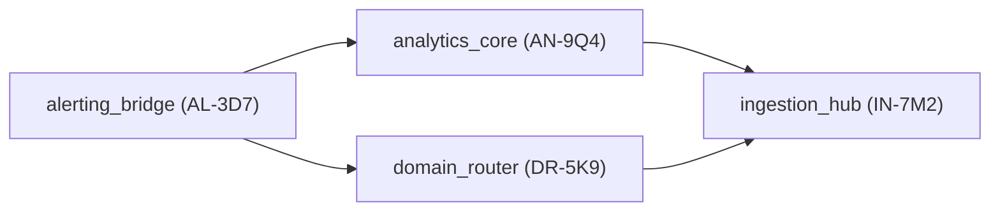

# Module Registry

Modules catalog and usage.

## Registry Source

- All modules are registered in [`modules/registry.yaml`](./registry.yaml).
- Use `tools/nameguard/create_module.py --module <key>` to scaffold new modules once they appear in the registry.
- Registry entries require: `id` (Two-ID), `name`, `version` (SemVer), `owner`, and `dependencies`.

## Dependency Visualization

The Mermaid diagram below is generated from the registry via `Test-ModuleRegistry -Path modules/registry.yaml -MermaidOutputPath .runs/ci/graph.mmd`.

The rendered graph is also exported to [`.runs/ci/graph.mmd`](../.runs/ci/graph.mmd) for CI consumption.
